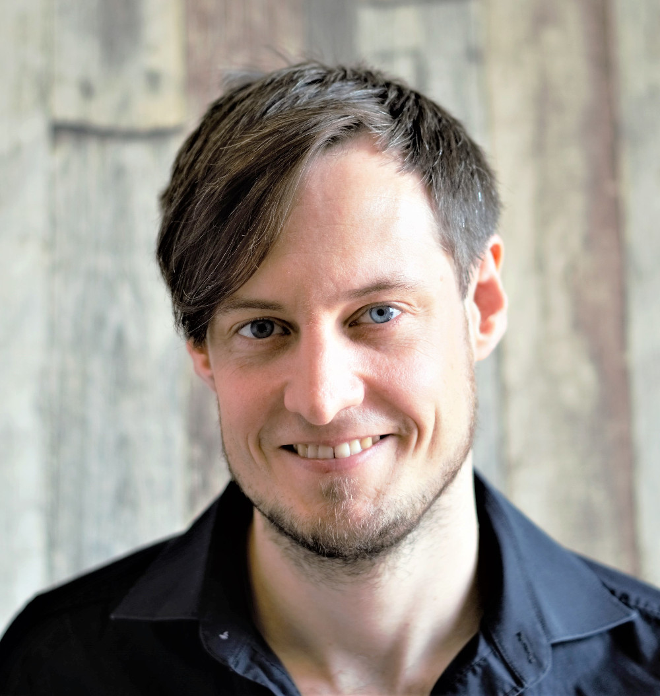

This is the professional website of Tim Schäfer. I am a bioinformatician and software engineer with considerable experience in computational neuroscience. I currently work as a research software engineer in the [Cognitive Neuropsychology department](https://www.aesthetics.mpg.de/en/research/department-of-cognitive-neuropsychology.html) at [Max-Planck Institute for Empirical Aesthetics](https://www.aesthetics.mpg.de/).

I have contributed to a range of open source projects and I am the author and maintainer of some neuroimaging software tools, including the [freesurferformats](https://github.com/dfsp-spirit/freesurferformats) and [fsbrain](https://github.com/dfsp-spirit/fsbrain) packages for R, and libraries providing access to neuroimaging data for C++, Julia, Rust and Python.

I am especially interested in spatial geometry, imaging, artificial intelligence and high-performance computing. I have recently started to also dive into music theory and digital audio processing. You can find the source code for most of my software on [my GitHub profile](https://github.com/dfsp-spirit).

You may be interested in my [projects](./projects.html), or the list of [my publications](./publications.html).
